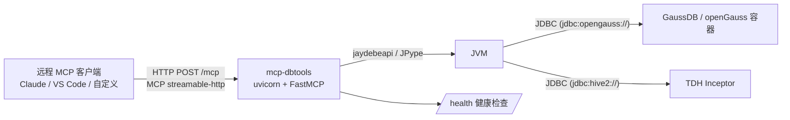

# mcp-dbtools

基于 **Python + JDBC** 的数据库 MCP（Model Context Protocol）服务，用于通过 LLM 客户端查询数据库。

> 📖 **完整使用操作说明（部署/配置/工具/排错）：见 [docs/使用说明.md](docs/使用说明.md)**

支持数据源：

| 数据源 | 驱动 | JDBC URL 示例 |
| --- | --- | --- |
| GaussDB / openGauss | `org.opengauss.Driver` | `jdbc:opengauss://host:5432/db` |
| TDH Inceptor（星环） | `org.apache.hive.jdbc.HiveDriver` | `jdbc:hive2://host:10000/default` |
| 其他 Hive 兼容 | `org.apache.hive.jdbc.HiveDriver` | `jdbc:hive2://...` |
| 其他 PostgreSQL 兼容 | `org.postgresql.Driver` | `jdbc:postgresql://...` |

- 服务部署在服务器上，远程客户端通过 **HTTP（MCP streamable-http）** 调用，也支持 SSE 与本地 stdio。
- JDBC 桥接通过 `jaydebeapi`（JPype 加载 JVM）。

## 架构



## 目录结构

```
mcp-dbtools/
├── src/mcp_dbtools/
│   ├── server.py        # MCP 服务入口（HTTP/SSE/stdio + 鉴权 + 健康检查）
│   ├── jdbc.py          # JDBC 连接管理、查询、元数据（按方言）
│   ├── tools.py         # MCP 工具定义
│   └── config.py        # 配置加载（datasources.json + 环境变量）
├── config/
│   ├── datasources.json          # 数据源配置（宿主机直连）
│   └── datasources.docker.json   # 数据源配置（Docker Compose 内部网络）
├── drivers/             # JDBC 驱动 jar（脚本下载 / 手工放置）
├── scripts/
│   ├── download_drivers.py   # 下载 openGauss 驱动
│   ├── mcp_client_demo.py    # HTTP 客户端演示
│   └── java/TdhTest.java     # TDH 连接自测工具
├── docker/              # Docker 部署与测试库
├── deploy/              # systemd 单元
└── tests/
```

## 环境要求

- Python 3.10+（已测 3.13）
- JRE/JDK 8+（JPype 需要，已测 OpenJDK 21）
- （部署）Docker 或 systemd Linux 服务器

## 快速开始

```bash
# 1. 安装依赖
python3 -m venv .venv
. .venv/bin/activate
pip install -r requirements.txt
pip install -e .

# 2. 生成配置
cp config/datasources.json.example config/datasources.json
cp .env.example .env                 # 按需修改密码

# 3. 下载 JDBC 驱动（openGauss/GaussDB）
python scripts/download_drivers.py

# 4. 启动 HTTP 服务
python -m mcp_dbtools --transport streamable-http
# 服务地址: http://<服务器IP>:8000/mcp

# 5. 验证
curl http://127.0.0.1:8000/health

# 6. 用演示客户端远程调用
python scripts/mcp_client_demo.py --url http://127.0.0.1:8000/mcp
```

### 对接已有 GaussDB 测试库

工作区已有的 `gaussdb` 容器（openGauss 5.0，端口 5432，库 `gaussdb`）已可直接使用。
注意：openGauss 容器默认 `pg_hba.conf` 只允许本机 `trust`，需要允许远程访问：

```bash
docker exec gaussdb bash -c \
  "echo 'host all all 0.0.0.0/0 sha256' >> /var/lib/opengauss/data/pg_hba.conf && kill -HUP 1"
```

## 配置说明（config/datasources.json）

```json
{
  "datasources": [
    {
      "name": "gaussdb_test",
      "type": "gaussdb",
      "description": "Docker 测试库",
      "driver_class": "org.opengauss.Driver",
      "jdbc_url": "jdbc:opengauss://127.0.0.1:5432/gaussdb",
      "username": "gaussdb",
      "password": "{ENV:GAUSS_PASSWORD}",
      "jars": ["opengauss-jdbc-5.0.0-og.jar"]
    }
  ]
}
```

- `type`: `gaussdb` / `opengauss` / `postgresql` 走 information_schema 方言；`tdh` / `hive` / `inceptor` 走 `SHOW DATABASES` 等 Hive 方言。
- `password` 支持 `{ENV:VAR}` 从环境变量注入，避免明文入库。
- 可用环境变量见 `.env.example`（`MCP_DBTOOLS_HOST/PORT/TRANSPORT/AUTH_TOKEN/CONFIG/DRIVERS_DIR/MAX_ROWS` 等）。

## MCP 工具

| 工具 | 说明 |
| --- | --- |
| `list_datasources` | 列出已配置数据源（不含密码） |
| `test_connection` | 测试 JDBC 连接，返回产品与版本 |
| `execute_query` | 执行 SQL（默认只读，写操作需 `confirm`；默认返回 300 行） |
| `execute_script` | **执行 SQL 脚本文件**，支持 `${V_DATE}` 等参数占位符 |
| `list_schemas` | 列出 schema / 数据库 |
| `list_tables` | 列出表（可按 schema、表名过滤） |
| `describe_table` | 查看表结构 |
| `get_status` | **监控**：数据源 JDBC 状态、JVM/进程内存、工具统计、运行时长 |
| `get_datasource_status` | **监控**：单个数据源连接/查询/错误/平均耗时 |
| `get_circuit_status` | **监控**：数据源熔断状态（是否熔断、失败次数、冷却剩余） |
| `get_execution_history` | **审计**：查询工具/SQL 执行历史（按工具、成败过滤） |
| `start_export` | **大数据量异步导出**：发起导出（自定义分隔符）→ 返回 `export_id` |
| `get_export_status` | **导出**：轮询导出任务状态（pending/running/succeeded/failed） |
| `list_exports` | **导出**：列出全部导出任务及下载地址 |
| `begin_transaction` | **事务**：在数据源开启事务（独占连接，关闭自动提交） |
| `execute_in_transaction` | **事务**：在活动事务内执行 SQL（不自动提交） |
| `commit_transaction` | **事务**：提交并结束事务 |
| `rollback_transaction` | **事务**：回滚并结束事务 |
| `get_transaction_status` | **事务**：查询活动事务状态与已持续时间 |

> 安全：工具只能访问 `datasources.json` 中预配置的连接，无法通过参数注入任意 JDBC URL。

## 性能与安全

### 连接池与并发
- 每个数据源维护 **JDBC 连接池**（默认 2 个连接，`MCP_DBTOOLS_POOL_SIZE` 可调），多客户并发请求复用连接。
- 工具异步执行（线程池），不阻塞事件循环，**支持多客户端并发调用**。

### SQL 注入与危险操作
- MCP 本质是执行 SQL（LLM 查询数据库），无法对用户 SQL 做参数化防注入；通过**多层缓解**控制风险：
  - 数据源白名单：工具只能连 `datasources.json` 预配置的连接；
  - **写操作二次确认**：`DELETE/UPDATE/INSERT/DROP/TRUNCATE` 等默认拦截，需显式 `confirm=true` 才执行（并记审计）；
  - `execute_script` 默认只读，脚本路径限定在脚本根目录内（防目录穿越）；
  - `${VAR}` 参数替换：来源限 `params` 与环境变量，缺失即报错。
- 全部调用写入审计（含调用方 IP / UA / SQL / 耗时）。

### 熔断机制
- 数据源**连续失败 N 次**（默认 3，可配）触发熔断，期间请求快速失败（不连库），冷却期后自动恢复（半开试探）。
- 查看：`get_circuit_status` 工具或 `/metrics`。

### 大数据量查询限制
- `execute_query` **默认最多返回 300 行**（`MCP_DBTOOLS_MAX_ROWS`），`limit` 参数上限 10000（`MCP_DBTOOLS_MAX_ROWS_LIMIT`），**不支持一次性拉全量大数据**，防止 OOM 与接口超时。

### 健康检查与自动重连
- HTTP `/health` 返回每个数据源的健康状态；`/health?deep=1` 时对每个数据源**真实执行 `SELECT 1`** 探测（含延迟）。
- 后台探活线程（`MCP_DBTOOLS_HEALTH_CHECK_INTERVAL`，默认 30s）定期探测各数据源，断连的连接在下次使用时**自动重建**（连接池丢弃坏连接并新建）。

### 按客户端 IP 限流
- 令牌桶限流（`MCP_DBTOOLS_RATE_LIMIT_QPS` 默认 10/s、突发 `BURST` 20），防止持有 token 的客户端无限调用打爆数据库；超限返回 HTTP 429。
- `/health` 豁免限流（供负载均衡探测）。

### 元数据结果缓存
- `list_schemas` / `list_tables` / `describe_table` 结果缓存 `MCP_DBTOOLS_META_CACHE_TTL`（默认 60s），大幅降低 LLM 频繁查元数据的数据库压力；缓存命中/未命中统计见 `/metrics`。

### 审计日志轮转
- 审计 JSONL 单文件超过 `MCP_DBTOOLS_AUDIT_MAX_BYTES`（默认 10MB）自动轮转为 `.1/.2/...`，保留 `MCP_DBTOOLS_AUDIT_BACKUP_COUNT`（默认 5）份，防止磁盘膨胀。

### 导出文件自动清理
- 后台定期清理超龄（`MCP_DBTOOLS_EXPORT_KEEP_SECONDS`，默认 1 天）与超量（`MCP_DBTOOLS_EXPORT_MAX_FILES`，默认 100）的导出文件，防止 `exports/` 目录无限增长。

### 显式事务
- 多步写操作可用 `begin_transaction` → `execute_in_transaction`（多条）→ `commit_transaction` / `rollback_transaction` 原子执行，避免半途而废。
- 同一数据源同时只允许一个活动事务；超过 `MCP_DBTOOLS_TX_TIMEOUT`（默认 300s）自动回滚并释放连接，防止连接泄漏。

## 大数据量异步导出（start_export）

当结果超过查询上限、需要完整数据时，使用**异步导出**（后台线程逐批写文件，不占内存）：

```python
# 1) 发起导出（只导出数据到文本文件，分隔符自定义，默认逗号）
start_export(datasource="gaussdb_test", sql="SELECT ...", delimiter=",", filename="report")
# -> {"id": "xxx", "status": "running", "download_url": "/export/xxx/download"}

# 2) 轮询检查
get_export_status(export_id="xxx")
# -> {"status": "succeeded", "rows": 100000, "columns": [...], ...}

# 3) 完成后下载
GET /export/{id}/download
```

约定：
- **只导出数据**（UTF-8 文本），字段用分隔符拼接（值含分隔符/引号/换行时按 RFC4180 加引号转义）；
- **CSV / Excel 等格式由客户端自行处理**，服务端不生成二进制格式；
- 分隔符可自定义（`\t`、`|`、`,` 等），表头行可选；
- 导出上限 `MCP_DBTOOLS_EXPORT_MAX_ROWS`（默认 10 万）。

## 脚本执行（execute_script）

`execute_script` 可在服务器上执行 SQL 脚本文件，支持 `${VAR}` 参数占位符（如 `${V_DATE}`）。

### 用法示例

```python
# MCP 客户端调用
execute_script(
    datasource="gaussdb_test",
    script_path="scripts/sql/demo_daily.sql",   # 服务器上脚本根目录内的文件
    params={"V_DATE": "2026-08-08"},            # 替换脚本中的 ${V_DATE}
)
```

返回每条语句的 `columns` / `rows` / `row_count` / `execution_time_ms` 及总耗时。示例脚本见 `scripts/sql/demo_daily.sql`。

### 参数占位符规则
- 脚本中的 `${VAR}` 会被替换；来源优先级：`params` → 环境变量 → 缺失则报错（列出缺少的参数名）。
- 参数值统一转字符串插入。

### 安全约束
- 脚本文件必须位于脚本根目录内（默认 `scripts/sql`，可用 `MCP_DBTOOLS_SCRIPT_ROOT` 配置），防止目录穿越读取任意文件。
- 默认 `read_only=true`，仅允许 `SELECT / SHOW / DESCRIBE / EXPLAIN / WITH` 语句；需要执行写操作时显式传 `read_only=false`（请谨慎，最终由数据库侧权限控制）。
- 多语句按分号拆分（忽略引号内分号与 `--` 行注释）；任一语句失败即停止后续。

## 监控与审计

### 监控指标
- **JDBC 状态**：每个数据源 `connected` / `connected_at` / `last_active` / `query_count` / `error_count` / `rows_returned` / `total_query_time_ms` / `avg_query_time_ms`
- **内存**：JVM 堆内存（`used`/`committed`/`max`）+ Python 进程 RSS
- **执行耗时**：`execute_query` 返回 `execution_time_ms`；工具级统计见 `get_status`/`/metrics`

### HTTP /metrics 端点
运维采集用（JSON），默认开启：

```bash
curl http://<服务器IP>:8000/metrics
# 返回: 数据源状态 / 内存 / 工具调用统计 / 运行时长
```

### 审计记录内容
每次工具调用记录：时间、工具名、**客户端 IP / User-Agent**、参数（含完整 SQL，超长自动截断）、耗时、成败、错误信息。通过 ASGI 中间件自动采集访问 IP，随请求上下文写入审计。

### 人工审计管理页面（/audit）
内置 Web 审计管理页面（无外部依赖，适配内网离线环境）：

```bash
# 浏览器打开
http://<服务器IP>:8000/audit
```

页面功能：
- **概览卡片**：审计总数、今日、成功/失败数量
- **多条件查询**：时间范围、工具、客户端 IP、SQL 关键字、成功/失败状态
- **表格分页** + **详情弹窗**（完整参数 JSON、错误、UA）
- **导出 CSV**
- 数据来自 SQLite 审计库（`logs/audit.db`，可用 `MCP_DBTOOLS_AUDIT_DB` 配置）

后端查询接口为 `GET /audit/api`（支持 `action=list / get / summary / export` 及筛选参数），供对接第三方审计系统。

> 安全：启用 `MCP_DBTOOLS_AUTH_TOKEN` 后，`/audit/api` 与 `/mcp`、`/metrics` 均需携带 `Authorization: Bearer <token>`（页面可通过「访问令牌」输入框或 `?token=` 传入）。

### 配置项（.env）
| 变量 | 默认 | 说明 |
| --- | --- | --- |
| `MCP_DBTOOLS_HISTORY_SIZE` | `500` | 内存执行历史条数 |
| `MCP_DBTOOLS_AUDIT_FILE` | `logs/audit.jsonl` | 审计日志(JSONL)路径，留空关闭 |
| `MCP_DBTOOLS_AUDIT_DB` | `logs/audit.db` | 审计 SQLite 库（审计页面数据源），空则禁用页面查询 |
| `MCP_DBTOOLS_METRICS_ENABLED` | `true` | 是否开放 `/metrics` |

> 提示：审计会记录 SQL 参数与访问 IP。若对敏感查询有顾虑，可关闭落盘（`MCP_DBTOOLS_AUDIT_FILE=`、`MCP_DBTOOLS_AUDIT_DB=`），仅保留内存历史。

## 客户端接入

### 通用 MCP 客户端（HTTP）

将 MCP 端点配置为 `http://<服务器IP>:8000/mcp`。以 Claude Desktop 为例：

```json
{
  "mcpServers": {
    "dbtools": {
      "type": "http",
      "url": "http://192.168.1.10:8000/mcp"
    }
  }
}
```

启用鉴权后需带请求头 `Authorization: Bearer <MCP_DBTOOLS_AUTH_TOKEN>`。

### 本地 stdio（开发调试）

```bash
python -m mcp_dbtools --transport stdio
```

## 服务器部署

### 方式一：Docker Compose（推荐，需外网/内网镜像源）

```bash
cp .env.example .env
docker compose -f docker/compose.yml up -d --build
curl http://localhost:8000/health
```

### 方式二：systemd（裸机）

见 `deploy/mcp-dbtools.service`，安装到 `/etc/systemd/system/` 后：

```bash
systemctl daemon-reload
systemctl enable --now mcp-dbtools
```

### 方式三：内网离线 + pm2（生产推荐，无需外网）

内网环境无法访问 PyPI / Docker Hub 时，通过**离线 pip 包 + pm2** 部署。

#### ① 在【外网构建机】生成离线包

```bash
bash scripts/build_offline.sh
# 产物: mcp-dbtools-offline-YYYYMMDD.tar.gz
# 内含: 项目 wheel + 全部运行时依赖 wheel + JDBC 驱动 + pm2 配置 + 安装脚本
```

> 构建机与内网机需**同为 Linux x86_64 + 相同 Python 主版本**（依赖含 manylinux 二进制 wheel，如 `jpype1`/`pydantic-core`）。

#### ② 拷贝到内网服务器并安装

内网机需先具备：**JRE 8+**（JPype 需要 JVM）、**Node.js + pm2**。

```bash
# 上传离线包后
tar xzf mcp-dbtools-offline-YYYYMMDD.tar.gz
bash mcp-dbtools-offline/install.sh            # 默认安装到 /opt/mcp-dbtools
# 安装脚本会自动: 建 venv -> --no-index 离线安装 -> 生成 .env -> pm2 启动
```

#### ③ 修改内网配置并重启

```bash
vim /opt/mcp-dbtools/.env                            # 端口、鉴权 Token、密码
vim /opt/mcp-dbtools/config/datasources.json         # 数据源 JDBC URL（内网地址）
pm2 restart mcp-dbtools
curl http://127.0.0.1:8000/health
```

#### pm2 常用命令

```bash
pm2 start deploy/ecosystem.config.cjs   # 启动
pm2 logs mcp-dbtools                    # 日志
pm2 reload mcp-dbtools                  # 重启
pm2 save && pm2 startup                 # 开机自启
```

pm2 配置见 `deploy/ecosystem.config.cjs`（可调端口、鉴权 Token、日志路径）。

## 测试

```bash
# 单元测试（配置、方言）
.venv/bin/python -m pytest tests/test_config.py tests/test_dialects.py -q

# 集成测试（需要 GaussDB/openGauss 测试库在 127.0.0.1:5432）
.venv/bin/python -m pytest tests/test_jdbc_integration.py -q
```

## 常见问题

- **`Invalid username/password` / 连接被拒**：检查目标库 `pg_hba.conf` 是否允许你的来源 IP（openGauss 默认仅本机）。
- **`Task group is not initialized`**：需将 `mcp.streamable_http_app()` 作为顶层 ASGI app 运行（本实现已处理），不要二次挂载。
- **TDH 连接失败**：先确保 Inceptor 的 HiveServer2 已启动（TDH 数据栈需在 Transwarp Manager 控制台部署），并用 `scripts/java/TdhTest.java` 验证端口与账号。
- **SOCKS 代理导致 HTTP 客户端报错**：演示客户端已通过 `trust_env=False` 忽略环境代理；若自写客户端，可安装 `httpx[socks]` 或设置 `NO_PROXY`。
