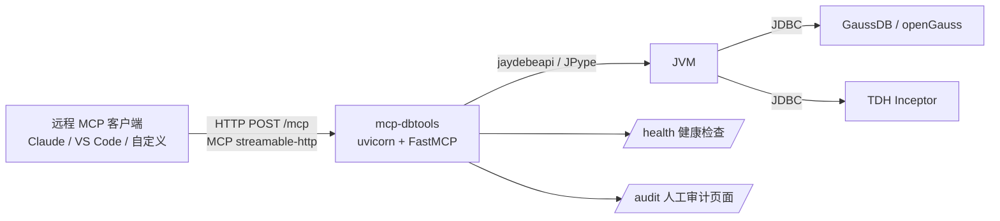

# mcp-dbtools 使用操作说明

> 本文档面向**运维 / 使用人员**，说明如何部署、配置、调用与维护 mcp-dbtools
> 数据库 MCP 服务。
> 对应版本：**v1.0.1** · 更新历史见 [CHANGELOG](../CHANGELOG.md)

---

## 1. 项目简介

mcp-dbtools 是一个基于 **Python + JDBC** 的数据库 MCP（Model Context Protocol）服务，
供 LLM 客户端（如 Claude、VS Code Copilot、自定义程序）通过标准 MCP 协议查询数据库。

**支持的数据源：**

| 数据源 | JDBC 驱动 | JDBC URL 示例 |
| --- | --- | --- |
| GaussDB / openGauss | `org.opengauss.Driver` | `jdbc:opengauss://host:5432/db` |
| TDH Inceptor（星环） | `org.apache.hive.jdbc.HiveDriver` | `jdbc:hive2://host:10000/default` |
| 其他 Hive 兼容 | `org.apache.hive.jdbc.HiveDriver` | `jdbc:hive2://...` |
| 其他 PostgreSQL 兼容 | `org.postgresql.Driver` | `jdbc:postgresql://...` |

**运行形态：** 服务部署在服务器上，通过 HTTP 对外提供 MCP 端点（`streamable-http`，
也支持 SSE 与本地 stdio）。

**架构：**



---

## 2. 快速部署

### 2.1 开发 / 调试环境（本机）

```bash
# 1. 创建虚拟环境并安装依赖
python3 -m venv .venv
. .venv/bin/activate
pip install -r requirements.txt
pip install -e .

# 2. 生成配置
cp config/datasources.json.example config/datasources.json
cp .env.example .env          # 按需修改密码

# 3. 下载 JDBC 驱动（openGauss/GaussDB）
python scripts/download_drivers.py

# 4. 启动 HTTP 服务
python -m mcp_dbtools --transport streamable-http
# 服务地址: http://<服务器IP>:8000/mcp
```

### 2.2 验证启动

```bash
# 健康检查（免鉴权）
curl http://127.0.0.1:8000/health
# 深度健康检查（真实 SELECT 1 探测每个数据源）
curl "http://127.0.0.1:8000/health?deep=1"
```

### 2.3 内网生产部署（pm2 离线包）

适用于**无法访问外网**的内网服务器（无 Docker 或不允许 Docker 时）：

1. **在外网构建机**生成离线包：
   ```bash
   bash scripts/build_offline.sh
   # 产物: mcp-dbtools-offline-*.tar.gz（项目 wheel + 依赖 + JDBC 驱动 + 配置）
   ```
2. **拷贝到内网机**并解压，执行安装：
   ```bash
   tar -xzf mcp-dbtools-offline-*.tar.gz
   bash mcp-dbtools-offline/install.sh
   # 会创建 .venv、离线安装依赖、生成 .env、pm2 start
   ```
3. **启动 / 查看 / 重启：**
   > `install.sh` 已自动启动服务，以下为日常管理命令（在安装目录执行）：
   ```bash
   cd /opt/mcp-dbtools
   pm2 start ecosystem.config.cjs   # 首次/手动启动
   pm2 save                         # 保存进程列表（配合 pm2 startup 开机自启）
   pm2 logs mcp-dbtools             # 查看日志
   pm2 reload mcp-dbtools           # 重启
   pm2 stop mcp-dbtools             # 停止
   ```

> 前置：内网机需已安装 **JRE/JDK 11+**（JPype 需要，JPype 1.5+ 不支持 Java 8）与 **Node.js/pm2**。
> 构建机与内网机需同为 Linux x86_64 且 Python 主版本一致（依赖含 manylinux 二进制 wheel）。

### 2.4 systemd 方式

也可使用 `deploy/mcp-dbtools.service` 交由 systemd 托管，修改其中的路径后：

```bash
sudo cp deploy/mcp-dbtools.service /etc/systemd/system/
sudo systemctl daemon-reload
sudo systemctl enable --now mcp-dbtools
```

---

## 3. 配置说明

### 3.1 数据源配置（config/datasources.json）

```json
{
  "datasources": [
    {
      "name": "gaussdb_test",
      "type": "gaussdb",
      "description": "Docker 测试库（openGauss 5.0）",
      "driver_class": "org.opengauss.Driver",
      "jdbc_url": "jdbc:opengauss://127.0.0.1:5432/gaussdb",
      "username": "gaussdb",
      "password": "{ENV:GAUSS_PASSWORD}",
      "jars": ["opengauss-jdbc-5.0.0-og.jar"]
    },
    {
      "name": "tdh_inceptor",
      "type": "tdh",
      "description": "TDH Inceptor",
      "driver_class": "org.apache.hive.jdbc.HiveDriver",
      "jdbc_url": "jdbc:hive2://127.0.0.1:10000/default",
      "username": "tdh",
      "password": "{ENV:TDH_PASSWORD}",
      "jars": ["inceptor-jdbc.jar"]
    }
  ]
}
```

字段说明：

| 字段 | 必填 | 说明 |
| --- | --- | --- |
| `name` | ✅ | 数据源唯一标识，MCP 工具用 `datasource` 参数引用 |
| `type` | ✅ | `gaussdb`/`opengauss`/`postgresql` 走 information_schema 方言；`tdh`/`hive`/`inceptor` 走 Hive 方言 |
| `jdbc_url` | ✅ | JDBC 连接串 |
| `driver_class` | ✅ | JDBC 驱动类全名 |
| `username` / `password` | 视驱动 | 密码**推荐用 `{ENC:...}` 加密存储**（见下），也可 `{ENV:VAR}` 引用环境变量 |
| `jars` | ✅ | JDBC 驱动 jar 文件名（放在 `drivers/` 目录） |
| `description` | 否 | 数据源说明 |
| `properties` | 否 | 额外连接属性 |

### 3.1.1 密码加密存储（推荐，不留明文）

配置文件（或备份/版本库）中**不应出现明文密码**。使用 `{ENC:...}` 加密串存储，
运行时用密钥 `MCP_DBTOOLS_SECRET_KEY` 自动解密（AES-256-GCM 认证加密，防篡改）。

**第一步：在 `.env` 配置密钥（妥善保管，勿提交代码库）**
```bash
MCP_DBTOOLS_SECRET_KEY=<你的强密钥>
```

**第二步：用工具生成加密串**（二选一）
```bash
# 推荐：从标准输入读取，明文不落 shell 历史
echo -n "Gauss@123" | MCP_DBTOOLS_SECRET_KEY=<密钥> python scripts/encrypt_password.py --stdin
# 或直接传参（明文会出现在 shell 历史）
MCP_DBTOOLS_SECRET_KEY=<密钥> python scripts/encrypt_password.py "Gauss@123"
# 输出示例: {ENC:...}（base64 密文）
```

**第三步：把输出填入 datasources.json**
```json
"password": "{ENC:xxxxxxxxxxxx}"
```

要点：
- 加密与运行需使用**同一个** `MCP_DBTOOLS_SECRET_KEY`；换密钥需重新生成各数据源密文；
- 密钥错误或密文被篡改时，服务启动会**明确报错**（不会静默连错库）；
- `{ENV:VAR}` 方式仍兼容（密码在环境变量中），但推荐改用 `{ENC:...}`；
- 该机制防「配置文件泄露时密码可读」，对外访问仍建议 HTTPS / 内网。

### 3.2 环境变量（.env）完整清单

服务会自动加载项目根目录 `.env`。以下为全部可配置项（默认值）：

#### 服务基础
| 变量 | 默认值 | 说明 |
| --- | --- | --- |
| `MCP_DBTOOLS_HOST` | `0.0.0.0` | 监听地址 |
| `MCP_DBTOOLS_PORT` | `8000` | 监听端口 |
| `MCP_DBTOOLS_TRANSPORT` | `streamable-http` | `streamable-http` / `sse` / `stdio` |
| `MCP_DBTOOLS_AUTH_TOKEN` | 空 | 设置后 HTTP 调用需携带 `Authorization: Bearer <token>` |
| `MCP_DBTOOLS_CONFIG` | `config/datasources.json` | 数据源配置路径 |
| `MCP_DBTOOLS_DRIVERS_DIR` | `drivers` | JDBC 驱动目录 |

#### 密码安全
| 变量 | 默认值 | 说明 |
| --- | --- | --- |
| `MCP_DBTOOLS_SECRET_KEY` | 空 | 解密 `{ENC:...}` 密码的主密钥；配置含加密密码时**必须设置** |

#### 查询与连接
| 变量 | 默认值 | 说明 |
| --- | --- | --- |
| `MCP_DBTOOLS_MAX_ROWS` | `300` | 单次查询默认返回行数上限 |
| `MCP_DBTOOLS_MAX_ROWS_LIMIT` | `10000` | `limit` 参数允许的最大值 |
| `MCP_DBTOOLS_CONNECT_TIMEOUT` | `30` | 连接超时（秒） |
| `MCP_DBTOOLS_POOL_SIZE` | `2` | 每数据源 JDBC 连接池大小 |

#### 熔断
| 变量 | 默认值 | 说明 |
| --- | --- | --- |
| `MCP_DBTOOLS_CIRCUIT_FAIL_THRESHOLD` | `3` | 连续失败 N 次触发熔断 |
| `MCP_DBTOOLS_CIRCUIT_COOLDOWN` | `30` | 熔断冷却时间（秒） |

#### 大数据量导出
| 变量 | 默认值 | 说明 |
| --- | --- | --- |
| `MCP_DBTOOLS_EXPORT_DIR` | `exports` | 导出文件目录 |
| `MCP_DBTOOLS_EXPORT_MAX_ROWS` | `100000` | 单次导出最大行数 |
| `MCP_DBTOOLS_EXPORT_KEEP_SECONDS` | `86400` | 导出文件保留时长（1 天），过期自动清理 |
| `MCP_DBTOOLS_EXPORT_MAX_FILES` | `100` | 最多保留的导出文件数 |

#### 监控与审计
| 变量 | 默认值 | 说明 |
| --- | --- | --- |
| `MCP_DBTOOLS_HISTORY_SIZE` | `500` | 执行历史环形缓冲条数 |
| `MCP_DBTOOLS_AUDIT_FILE` | `logs/audit.jsonl` | 审计 JSONL 路径，置空关闭落盘 |
| `MCP_DBTOOLS_AUDIT_DB` | `logs/audit.db` | 审计 SQLite 库（审计页面数据源） |
| `MCP_DBTOOLS_METRICS_ENABLED` | `true` | 是否开放 `/metrics` |
| `MCP_DBTOOLS_AUDIT_MAX_BYTES` | `10485760` | 审计单文件超过后自动轮转（10MB） |
| `MCP_DBTOOLS_AUDIT_BACKUP_COUNT` | `5` | 审计轮转保留备份份数 |

#### 健康检查与限流
| 变量 | 默认值 | 说明 |
| --- | --- | --- |
| `MCP_DBTOOLS_HEALTH_CHECK_INTERVAL` | `30` | 后台探活/自动重连间隔（秒） |
| `MCP_DBTOOLS_RATE_LIMIT_ENABLED` | `true` | 是否启用按 IP 的 QPS 限流 |
| `MCP_DBTOOLS_RATE_LIMIT_QPS` | `10` | 每客户端每秒请求上限 |
| `MCP_DBTOOLS_RATE_LIMIT_BURST` | `20` | 突发令牌容量 |

#### 缓存与事务
| 变量 | 默认值 | 说明 |
| --- | --- | --- |
| `MCP_DBTOOLS_META_CACHE_TTL` | `60` | 元数据查询缓存有效期（秒），`0` 关闭 |
| `MCP_DBTOOLS_META_CACHE_MAX_ITEMS` | `256` | 元数据缓存最大条目数 |
| `MCP_DBTOOLS_TX_TIMEOUT` | `300` | 事务最大持续时间（秒），超时自动回滚 |

#### 服务日志（落盘 + 轮转）
| 变量 | 默认值 | 说明 |
| --- | --- | --- |
| `MCP_DBTOOLS_LOG_FILE` | `logs/app.log` | 应用日志文件路径；设为空则仅输出控制台 |
| `MCP_DBTOOLS_LOG_MAX_BYTES` | `10485760` | 单日志文件超过后自动轮转 `.1/.2/...`（10MB） |
| `MCP_DBTOOLS_LOG_BACKUP_COUNT` | `5` | 日志轮转保留备份份数 |

#### 脚本执行
| 变量 | 默认值 | 说明 |
| --- | --- | --- |
| `MCP_DBTOOLS_SCRIPT_ROOT` | `scripts/sql` | SQL 脚本根目录（`execute_script` 限定于此） |

---

## 4. HTTP 端点一览

| 端点 | 鉴权 | 说明 |
| --- | --- | --- |
| `POST /mcp` | ✅ 需要 | **MCP 端点**，LLM 客户端调用工具走这里 |
| `GET /health` | ❌ 免鉴权 | 健康检查；`?deep=1` 深度探测（真实 SELECT 1） |
| `GET /metrics` | ✅ 需要 | 监控 JSON：数据源状态、内存、工具统计、缓存、事务 |
| `GET /audit` | ❌ 免鉴权 | 人工审计页面（HTML 壳，数据在 API 保护） |
| `GET /audit/api` | ✅ 需要 | 审计查询 API（`action=list/get/summary/export`） |
| `GET /logs` | ❌ 免鉴权 | **服务日志查看页面**（HTML 壳，数据在 API 保护） |
| `GET /logs/api` | ✅ 需要 | 日志查询 API（`action=tail&lines=200&q=关键字`） |
| `GET /export/{id}/download` | ✅ 需要 | 下载异步导出的文件 |

> 鉴权方式：请求头 `Authorization: Bearer <token>`，或 URL 参数 `?token=<token>`。

---

## 5. MCP 工具使用说明

服务共提供 **19 个 MCP 工具**，按功能分组说明。

> 通用约定：
> - `datasource` 参数传入 `datasources.json` 里配置的数据源 `name`（先调 `list_datasources` 查看）。
> - **写操作**（DELETE/UPDATE/INSERT/DROP/TRUNCATE 等）默认被拦截，必须传 `confirm=true` 才执行（并记审计）。
> - 所有调用都会记录审计（时间、调用方 IP/UA、参数、耗时、成败）。

### 5.1 连接与元数据

| 工具 | 参数 | 说明 |
| --- | --- | --- |
| `list_datasources` | 无 | 列出所有数据源（不含密码） |
| `test_connection` | `datasource` | 测试连接，返回数据库产品与版本 |
| `list_schemas` | `datasource` | 列出 schema / 数据库 |
| `list_tables` | `datasource`，`schema_name?`，`search?` | 列出表（可按 schema、表名模糊过滤） |
| `describe_table` | `datasource`，`table`，`schema_name?` | 查看表结构（列名、类型、可空性、默认值） |

> 以上元数据查询结果带 **TTL 缓存**（默认 60s），表结构变更后最长 1 分钟生效。

### 5.2 查询执行

**`execute_query`** —— 核心查询工具

| 参数 | 必填 | 说明 |
| --- | --- | --- |
| `datasource` | ✅ | 数据源名称 |
| `sql` | ✅ | SQL 语句 |
| `limit` | 否 | 最多返回行数（默认 300，上限 10000） |
| `confirm` | 否 | 写操作二次确认（默认 false 拦截） |

示例（LLM 调用）：查询某表前 10 行：

```json
{ "datasource": "gaussdb_test", "sql": "SELECT * FROM employees ORDER BY id LIMIT 10" }
```

返回：`columns`、`rows`、`row_count`、`truncated`、`execution_time_ms`。

> 注意：单次查询默认最多返回 300 行。要拉全量大数据请用 **异步导出**（见 5.5）。

**`execute_script`** —— 执行服务器上的 SQL 脚本文件

| 参数 | 必填 | 说明 |
| --- | --- | --- |
| `datasource` | ✅ | 数据源名称 |
| `script_path` | ✅ | 脚本相对路径（须在 `script_root` 内，防目录穿越） |
| `params` | 否 | 脚本参数，替换 `${V_DATE}` 等占位符 |
| `read_only` | 否 | 只读模式（默认 true，禁止非查询语句） |
| `limit` | 否 | 每条语句最多返回行数（默认 300） |
| `confirm` | 否 | 写操作二次确认（`read_only=false` 且含写语句时需要） |

脚本支持 `${VAR}` 占位符，参数来源优先级：`params` → 环境变量 → 缺失报错。
脚本按分号拆分（忽略引号内分号与 `--` 注释），**任一语句失败即停止后续**。

### 5.3 显式事务

多步写操作需要原子执行时使用事务：

| 工具 | 参数 | 说明 |
| --- | --- | --- |
| `begin_transaction` | `datasource` | 开启事务（独占连接、关闭自动提交） |
| `execute_in_transaction` | `datasource`，`sql`，`limit?`，`confirm?` | 在事务内执行（不自动提交） |
| `commit_transaction` | `datasource` | 提交并结束事务 |
| `rollback_transaction` | `datasource` | 回滚并结束事务 |
| `get_transaction_status` | `datasource` | 查询活动事务状态与已持续时间 |

**典型流程：**

```text
1. begin_transaction(datasource="gaussdb_test")
2. execute_in_transaction("UPDATE accounts SET balance=balance-100 WHERE id=1", confirm=true)
3. execute_in_transaction("UPDATE accounts SET balance=balance+100 WHERE id=2", confirm=true)
4. commit_transaction()
   （任一步出错则改调 rollback_transaction()）
```

> 同一数据源同时只允许一个活动事务；超过 `MCP_DBTOOLS_TX_TIMEOUT`（默认 300s）
> **自动回滚并释放连接**，防止连接泄漏。

### 5.4 监控与审计

| 工具 | 参数 | 说明 |
| --- | --- | --- |
| `get_status` | 无 | 监控总览：数据源 JDBC 状态、内存、工具统计、缓存与事务 |
| `get_datasource_status` | `datasource` | 单数据源连接/查询/错误/平均耗时 |
| `get_circuit_status` | `datasource` | 熔断状态（是否熔断、失败次数、冷却剩余） |
| `get_execution_history` | `limit?`，`tool?`，`ok?` | 查询工具/SQL 执行历史 |

### 5.5 大数据量异步导出

当结果超过查询上限、需要完整数据时使用：

| 工具 | 参数 | 说明 |
| --- | --- | --- |
| `start_export` | `datasource`，`sql`，`delimiter?`（默认 `,`），`include_header?`，`filename?`，`limit?`（默认 100000），`confirm?` | 发起导出，返回 `export_id` 与 `download_url` |
| `get_export_status` | `export_id` | 轮询任务状态（pending/running/succeeded/failed） |
| `list_exports` | 无 | 列出全部导出任务及下载地址 |

**典型流程：**

```text
1. start_export(datasource="gaussdb_test", sql="SELECT * FROM big_table", delimiter=",")
   -> { export_id: "a1b2c3", download_url: "/export/a1b2c3/download" }
2. get_export_status(export_id="a1b2c3")   // 轮询直到 succeeded
3. 客户端访问: http://<服务器>:8000/export/a1b2c3/download 下载文件
```

> 导出在后台线程逐批写文件，不占内存；只导出数据文本（自定义分隔符），
> CSV/Excel 由客户端自行解析。导出文件由后台定期清理（默认保留 1 天、最多 100 个）。

---

## 6. 客户端接入方式

### 6.1 命令行验证（mcp_client_demo.py）

```bash
.venv/bin/python scripts/mcp_client_demo.py --url http://127.0.0.1:8000/mcp \
    --token <MCP_DBTOOLS_AUTH_TOKEN> \
    --datasource gaussdb_test --sql "SELECT * FROM employees LIMIT 5"
```

### 6.2 Claude Desktop / VS Code 等 MCP 客户端

配置 MCP server 为 streamable-http 模式，指向 `http://<服务器>:8000/mcp`，
并在请求头携带 `Authorization: Bearer <token>`（若开启了鉴权）。

### 6.3 通用 curl 调用 /mcp

```bash
curl -X POST http://127.0.0.1:8000/mcp \
  -H "Authorization: Bearer <token>" \
  -H "Content-Type: application/json" \
  -H "Accept: application/json, text/event-stream" \
  -d '{"jsonrpc":"2.0","method":"tools/list","id":1,"params":{}}'
```

---

## 7. 安全机制说明

| 机制 | 说明 | 配置 |
| --- | --- | --- |
| **Bearer 鉴权** | 未携带正确 token 返回 401 | `MCP_DBTOOLS_AUTH_TOKEN` |
| **数据源白名单** | 工具只能连配置内预定义连接，无法注入任意 JDBC URL | 配置文件 |
| **写操作二次确认** | DELETE/UPDATE 等默认拦截，需 `confirm=true` 并记审计 | 内置 |
| **脚本路径限制** | `execute_script` 只能执行脚本根目录内文件（防目录穿越） | `MCP_DBTOOLS_SCRIPT_ROOT` |
| **只读模式** | `execute_script` 默认只允许 SELECT/SHOW/DESCRIBE/EXPLAIN/WITH | `read_only` |
| **熔断** | 连续失败 N 次触发熔断，冷却后半开恢复 | `MCP_DBTOOLS_CIRCUIT_*` |
| **行数限制** | 单次查询默认 300 行、上限 10000，防 OOM | `MCP_DBTOOLS_MAX_ROWS*` |
| **限流** | 按客户端 IP 令牌桶限 QPS，超限 429 | `MCP_DBTOOLS_RATE_LIMIT_*` |
| **审计** | 全部调用落盘（JSONL + SQLite），含 IP/UA/参数/耗时 | `MCP_DBTOOLS_AUDIT_*` |
| **敏感信息** | 数据源密码经 `{ENV:VAR}` 注入，接口返回不包含密码 | 配置文件 |

---

## 8. 监控与人工审计

### 8.1 人工审计页面

浏览器访问 `http://<服务器>:8000/audit`，可：

- **查询**：按工具、IP、成败、关键字、时间范围分页检索审计记录；
- **详情**：查看单条记录的完整参数；
- **统计**：总量、今日、成功/失败、Top 工具与 IP 概览；
- **导出 CSV**：按当前筛选条件导出审计数据。

> 页面本身免鉴权（HTML 壳），但查询数据接口 `/audit/api` 需要 token。

### 8.2 /metrics 监控指标

带 token 访问 `http://<服务器>:8000/metrics`，返回 JSON：
数据源连接/查询/错误统计、JVM 与进程内存、工具调用统计、元数据缓存命中、事务状态等。

### 8.3 审计落盘文件

- `logs/audit.jsonl`：JSONL 审计日志，单文件超过 10MB 自动轮转为 `.1/.2/...`（保留 5 份）；
- `logs/audit.db`：SQLite 审计库（审计页面查询数据源）。

### 8.4 服务日志查看

服务运行日志默认落盘到 `logs/app.log`（按大小轮转），两个查看途径：

1. **网页查看**：浏览器访问 `http://<服务器>:8000/logs`
   - 支持尾部行数选择（100/200/500/1000）、**关键字过滤**（如 `ERROR`、数据源名）、手动刷新与 5s 自动刷新；
   - 页面免鉴权（HTML 壳），数据接口 `/logs/api` 需 token。
2. **命令行**：
   ```bash
   tail -f logs/app.log                 # 直接看文件
   pm2 logs mcp-dbtools                 # pm2 部署时看 stdout/stderr
   ```

> 日志文件只保留最近的 `LOG_BACKUP_COUNT` 份（默认 5 份、每份 10MB），不会无限膨胀。

---

## 9. 常见问题（FAQ）

**Q1：为什么查询报"检测到写操作语句"？**
因为 SQL 是写操作（DELETE/UPDATE/INSERT 等）且未传 `confirm=true`。确认无误后传入
`confirm=true` 即可（会记审计）。

**Q2：查询返回的行数只有 300 行？**
这是防 OOM 的保护。要拿全量数据，请改用 `start_export` 异步导出。

**Q3：提示"数据源处于熔断状态"？**
数据源连续失败触发了熔断。等待冷却（默认 30s）后自动恢复，或排查数据库连通性后重启服务。

**Q4：调用返回 HTTP 429？**
触发了按 IP 的限流。稍等片刻（令牌补充）再试，或调大 `MCP_DBTOOLS_RATE_LIMIT_QPS/BURST`。

**Q5：事务提示"已有活动事务"？**
同一数据源同一时间只允许一个事务。先 commit/rollback 旧的；若怀疑超时未释放，用
`get_transaction_status` 查看，超过 `TX_TIMEOUT` 会自动回滚。

**Q6：配置改了没生效？**
数据源配置与 `.env` 在启动时加载，修改后需重启服务（`pm2 reload mcp-dbtools`）。

**Q7：TDH/Inceptor 连不上？**
确认 TDH 驱动 jar 已放入 `drivers/`（如 `inceptor-jdbc.jar`）且数据栈（HDFS/YARN/Inceptor）
已部署，端口 10000 可达。

**Q8：JVM 相关报错？**
确认已安装 JRE/JDK 11+（JPype 1.5+ 不支持 Java 8，Java 8 上 `jpype.startJVM()` 会报 JavaVersion 错误）。JPype 需要可用的 JVM。

---

## 10. 目录结构速览

```
mcp-dbtools/
├── src/mcp_dbtools/
│   ├── server.py      # 服务入口（HTTP/鉴权/健康检查/限流/审计页面）
│   ├── jdbc.py        # JDBC 连接池、查询、元数据缓存、熔断、事务、健康检查
│   ├── tools.py       # 19 个 MCP 工具定义
│   ├── config.py      # 配置加载（datasources.json + 环境变量）
│   ├── monitor.py     # 审计（JSONL 轮转 + SQLite）、执行历史、指标
│   ├── export.py      # 异步导出 + 过期文件清理
│   ├── audit_page.py  # 人工审计 HTML 页面
│   ├── logs_page.py   # 服务日志查看页面
│   ├── crypto.py      # 密码加密存储（{ENC:...}）
│   └── ratelimit.py   # 令牌桶限流中间件
├── config/datasources.json    # 数据源配置
├── drivers/                   # JDBC 驱动 jar
├── scripts/                   # 驱动下载、客户端演示、离线构建脚本
├── scripts/sql/               # SQL 脚本根目录（execute_script 使用）
├── deploy/                    # pm2 / systemd 部署文件
├── exports/                   # 导出文件目录（自动清理）
└── logs/                      # 审计日志
```
